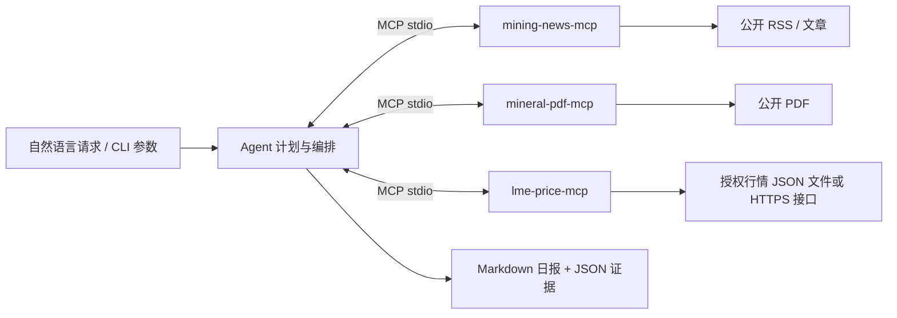

# 矿权日报 Agent

面试题 **第 2 题** 的独立实现：三个 TypeScript MCP Server，通过官方 MCP SDK 的 stdio 协议连接一个确定性编排客户端，输出带来源链接的 Markdown 日报和 JSON 证据记录。

输入示例：`给我生成一份关于 Pilbara 锂矿的今日简报`。

## 快速运行

需要 Node.js 22.13+（推荐 24）和 npm。

```sh
npm ci
npm run build
npm run demo
```

查看 `reports/demo.md`。演示日期固定为 2026-09-20，**所有演示新闻、资源量和价格均为合成数据**；演示不需要网络、API Key 或 LME 订阅。

Docker 一条命令：

```sh
docker compose run --build --rm brief
```

完整配置、实时运行与 Claude Desktop / Cursor 接入见 [RUN.md](RUN.md)。

## 交付映射

| 题目要求          | 实现                                                                                           |
| ----------------- | ---------------------------------------------------------------------------------------------- |
| `mining-news-mcp` | `search(query, days)`、`fetch_article(url)`；RSS 聚合、日期过滤、去重、全文摘录                |
| `mineral-pdf-mcp` | `extract_resources(pdf_url)`；PDF 文本提取、Indicated/Inferred、单位归一化、页码证据、数值校验 |
| `lme-price-mcp`   | `get_price(commodity, date)`、`get_trend(commodity, days)`；授权 JSON 行情适配、日期和基准校验 |
| Agent client      | 自定义确定性工作流：计划 → 并发检索 → 新闻正文补取 → 证据检查 → Markdown/JSON                  |
| MCP 配置          | `mcp-config.json` 与 `npm run config` 生成的绝对路径配置                                       |
| 5 分钟启动        | `RUN.md`、多阶段 Dockerfile、Compose、无密钥离线演示                                           |

三个服务由 `src/servers/main.ts news|pdf|price` 启动为**三个独立进程**，分别声明工具。Agent 不通过直接导入 Provider 绕过 MCP。



## 设计取舍

- **无需模型密钥即可复现。** 题目允许自定义编排，本实现用明确的计划和状态转换；新闻摘要采用有标识的来源摘录，不生成无依据的事实。自然语言解析覆盖项目名和锂、铜、镍、锌，其他表达可用 `--topic`、`--commodity` 精确指定。
- **不伪造 LME 实时接口。** 实时价格需要使用者提供有权使用的数据，系统校验统一 schema。没有配置时返回 `unavailable`；不会把铜或镍作为锂价格，也不会把演示数字放入实时日报。
- **宁可待审核，也不猜表格。** PDF 解析器仅接受单位明确且含量计算误差不超过 5% 的资源行。复杂表格、扫描件、未支持的布局或矛盾数据返回 `needs_review`。这不是通用 OCR，也不是 NI 43-101 合规认证器。
- **失败可见。** 单一来源失败不阻塞其他来源，日报保留缺失原因。数据来源文本不会进入可执行代码或系统提示词。
- **资源量不是储量。** 不把 Indicated/Inferred Resources 改称 Reserves，也不把 Li2O 含量当成金属锂。

## 工程质量

```sh
npm run check
```

包含 TypeScript strict、ESLint、Prettier、单元测试、真实 PDF 字节流解析测试、三个子进程之间的 MCP 集成测试，以及生产构建。GitHub Actions 配置了 Windows/Linux、Node 22/24 的检查矩阵和 Docker 冒烟测试。依赖由 `package-lock.json` 锁定。

测试网络隔离，不要求 LME 账号；**测试通过并不证明任意公开 PDF 可自动解析，也不证明行情供应商可用**。

目录与数据契约见 [ARCHITECTURE.md](ARCHITECTURE.md)、[DATA_NOTES.md](DATA_NOTES.md)。项目不包含原始面试文档、个人账号信息或第三方受限数据。

## 上游文档

- [官方 MCP TypeScript SDK](https://ts.sdk.modelcontextprotocol.io/)
- [MCP stdio Server](https://ts.sdk.modelcontextprotocol.io/server)
- [MCP Client](https://ts.sdk.modelcontextprotocol.io/client)
- [pdf-parse](https://github.com/mehmet-kozan/pdf-parse)

使用 MIT 许可证，见 [LICENSE](LICENSE)。
